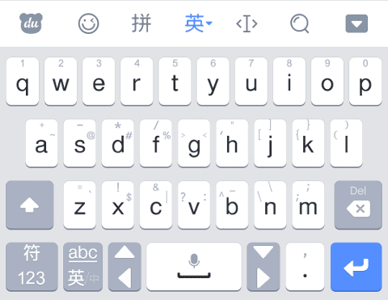

# ProgrammingKeyboard
百度输入法的皮肤，为编程打造，  
基于默认皮肤，仅修改竖屏英文全键盘，添加所有ascii符号，  

  

2.0:
基于最新的默认皮肤重做，
其他修改如下，
1. 去掉“啊鱼”字样，其实我也觉得挺丑的，
2. v键上拉改成tab, 空格行为改不了，就把tab放这里了，
3. g上拉改成切换输入法，新版默认皮肤g键在正中，设计成上左右都不同，
4. 去掉自定义符号栏，新版的懒人短语更好用，而且百度栏有快速移动光标很好用，
5. 不显示一些字符，左边的按键左划和上划效果是一致的，不显示左划字符，右边同理，
6. 不显示op键之间的下拉收起软键盘，但保留功能，因为保留了百度栏，也就保留了右上按钮可以点击收起，这个不必须了，

1.2:
修复BUG如下，
1. 大写状态下，方向键右不能使用，
其他修改如下，
1. Shift键改成锁定大写，加个上划对应原来的首字母大写，
2. 退格键，加个上划删除功能，可惜c4droid用不了，但是其他有的地方能用的，

1.1.2:
修复BUG如下，
1. 切换主题时皮肤变回默认，研究表明，切换主题后显示的东西界面会变，这个无解与皮肤无关，但是输入不变，
其他修改如下，
1. o和p键下拉收起面板，缺了个图标，加上了个下三角，

1.1.1:
修复BUG如下，
1. 自定义符号栏没有默认值，

1.1:
修复BUG如下，
1. 联想状态输入大写无法联想，
2. 联想状态adc图标与非联想状态一样，
其他修改如下，
1. b键的左右功能交换，我的目的是，左边的键是上和左一样，右边的键是上和右一样，
2. 压缩了那张demo.png，从60+kb压到18kb，肉眼看不影响质量，我自己显然没这水平，TinyPNG这个网站干的，
另外还加了一大堆注释，具体文件如下，
1. port/en_26.ini
2. port/res/default.css
3. port/gen.ini
4. res/fore2.til
